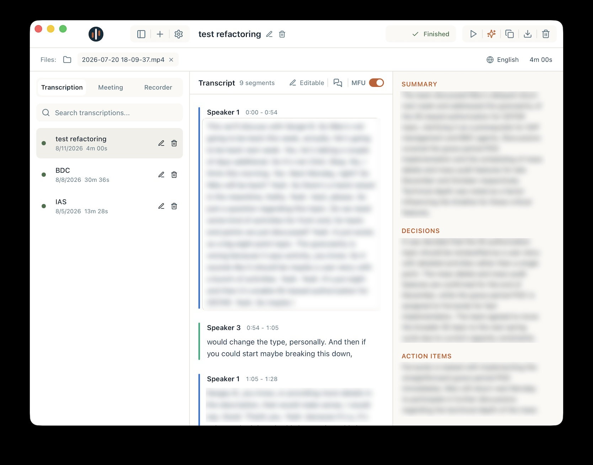
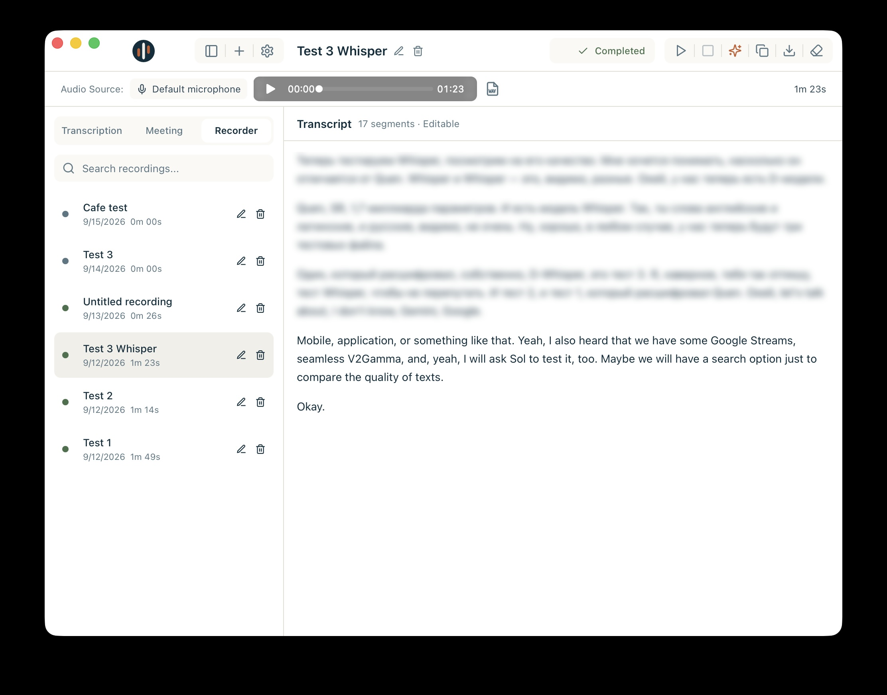

# WhisperPilot


WhisperPilot is a macOS app for local transcription. It turns files, live
system audio, and microphone recordings into editable transcripts while keeping
the core transcription and AI workflows on your Mac.

See the [version roadmap](ROADMAP.md) for the planned `v1.30`, `v1.40`, and
`v1.50` milestones.

## Three ways to work

### Transcription

Import an audio or video file, transcribe it locally, edit the result, identify
speakers, create structured notes, and export the finished text.



### Meeting

Listen to system audio during a live meeting, follow the transcript as it
arrives, and optionally show a paired translation. Completed sessions remain
in the local library for later editing, notes, and export.


### Recorder

Capture your microphone into durable local audio, continue a recording later,
review the transcript as it settles, polish it in place, and export either text
or WAV audio.



## Local models and settings

Choose the local transcription and text models that fit your hardware. The app
uses Whisper large-v3-turbo by default and also supports Qwen3-ASR 1.7B Q8_0
for Transcription, Meeting, and Recorder. Appearance and status colors are
configured in Settings.


## Requirements

- Apple Silicon Mac running macOS 13 or later
- [`ffmpeg`](https://ffmpeg.org/) on `PATH`:

  ```sh
  brew install ffmpeg
  ```

## Run from source

WhisperPilot is not distributed as a packaged download yet.

```sh
npm install
npm run tauri:dev
```

The first run compiles the Metal-accelerated local Whisper engine. See the
[developer guide](docs/development.md) for setup, validation, and packaging.

## Build

```sh
npx tauri build
```

The DMG is written under `src-tauri/target/release/bundle/dmg/`.

## Privacy

Your transcripts, Recorder audio, model files, and local AI work stay on your
Mac. See the [privacy boundary](docs/architecture/desktop.md#security-and-privacy)
for the complete technical description.

## License

[Apache License 2.0](LICENSE)
