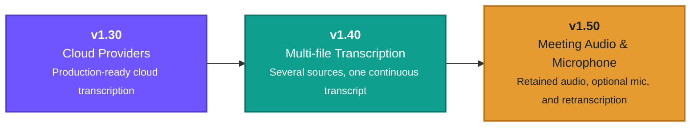

# WhisperPilot Roadmap

WhisperPilot evolves through capability-focused releases. This roadmap uses
versions rather than dates: each milestone ships when its workflow is complete,
reliable, and ready for everyday use.

## v1.30 — Cloud Providers

Turn the existing cloud groundwork into a complete, production-ready workflow:
polished provider setup, secure credential handling, predictable lifecycle and
error recovery, and a consistent Meeting experience across local and cloud
transcription.

## v1.40 — Multi-file Transcription

Allow one Transcription to contain several audio or video files. Sources will be
processed in an explicit order and combined into one coherent transcript while
retaining enough source boundaries to review and manage the result reliably.

## v1.50 — Meeting Audio & Microphone

Add an optional microphone switch when starting a Meeting. A session will be
able to capture both system audio and the user's own microphone, while keeping
system-audio-only capture as the default. Meeting audio will be retained as a
durable source, with compact playback and WAV export presented alongside the
source details, as in Recorder.

A dedicated header action near the Meeting source and MFU controls will rerun
transcription from the retained original audio. Clearing a Meeting will remove
the transcript, MFU, translations, and its retained audio after confirmation.

For implementation-level sequencing and release criteria, see the
[internal roadmap](docs/roadmap.md).
